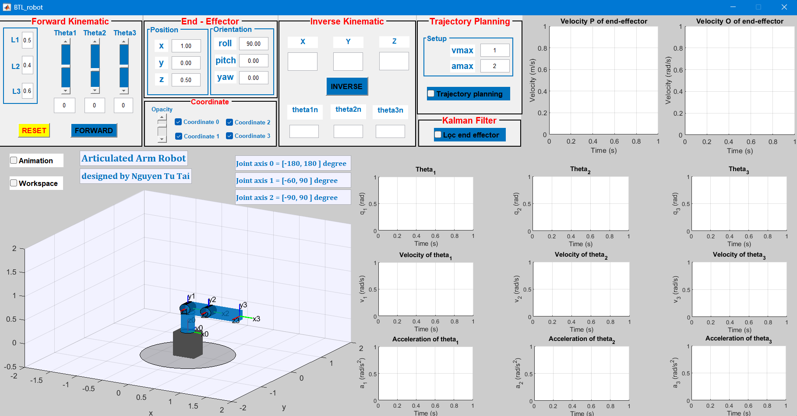
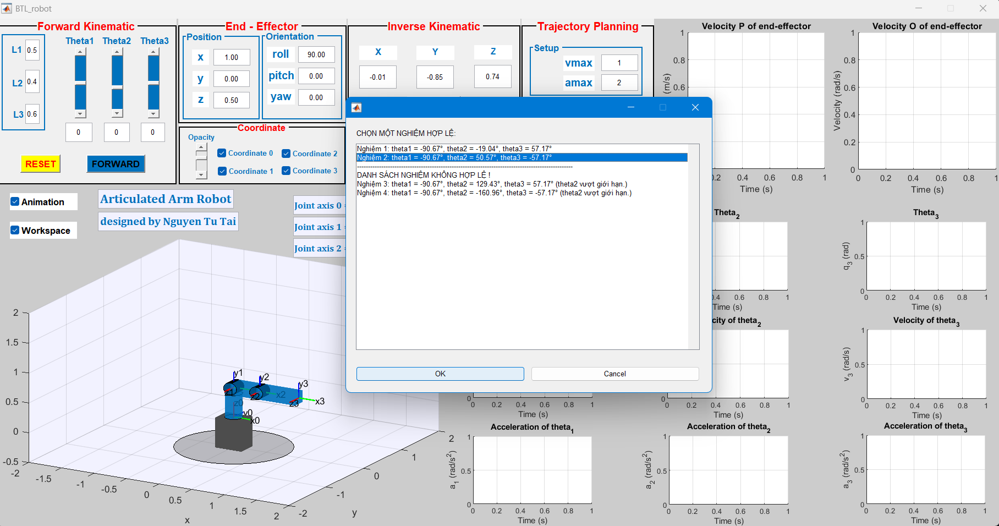
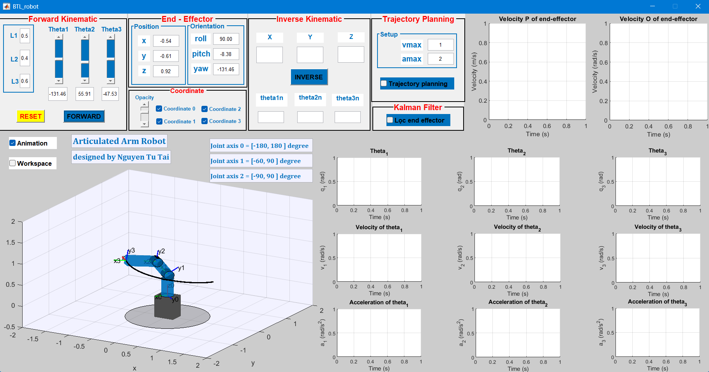
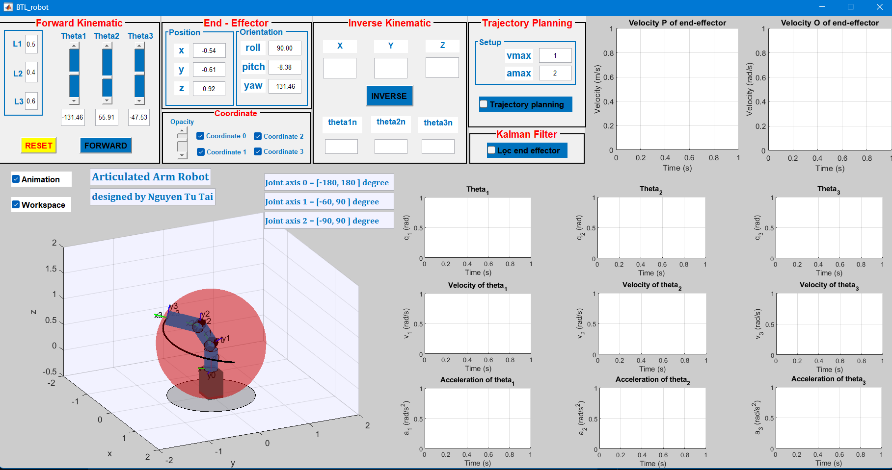

# 🤖 3-DOF Articulated Robot Arm – Kinematic Simulation in MATLAB

This project simulates the **forward and inverse kinematics** of a 3-DOF articulated robot arm using MATLAB. It features a full GUI interface, real-time 3D animation, trajectory planning, workspace visualization, and end-effector velocity/acceleration analysis.

---

## 🎯 Key Features

✔️ **Forward Kinematics** – Compute end-effector position from joint angles  
✔️ **Inverse Kinematics** – Solve multiple solutions, auto filter by joint limits  
✔️ **Trajectory Planning** – Smooth motion with velocity/acceleration constraints  
✔️ **Workspace Visualization** – Toggle workspace boundary  
✔️ **Kalman Filter (optional)** – Smoothing velocity signal  
✔️ **Real-time Animation** – Plot joint states and 3D movement  
✔️ **Intuitive GUI** – Built with `.fig` file + button callbacks

---

## 📸 Interface Snapshots

| | |
|-----------------------------|------------------------------|
| 🔧 **Main GUI Interface**     | 🔄 **Select Inverse Kinematic Solution**     |
| 🚫 **IK without Trajectory Planning**    | ✅ **IK with Trajectory Planning Enabled**    |
| 🌀 **Kinematic Mode (Workspace Hidden)**    | 🌐 **Workspace Visualization Enabled**    |

---

## 📁 Project Structure

| File | Description |
|------|-------------|
| `BTL_robot.fig` | Main GUI layout |
| `Forward_Kinematic.m` | Compute end-effector position |
| `Inverse_Kinematic.m` | Solve θ1, θ2, θ3 from (x, y, z) |
| `plot_*.m` | Visualization of motion and states |
| `calculate_Trajectory.m` | Generate motion curves |
| `kalman_filter.m` | Signal smoothing |
| `animation.m` | Render robot movement |
| `button_*.m` | GUI callbacks for control |

---

## 🚀 How to Run

1. Open MATLAB (R2021a+ recommended)  
2. Run `BTL_robot.fig`  
3. Select mode:  
   - Forward → input joint angles  
   - Inverse → input position  
4. Toggle animation, workspace, and trajectory  
5. Observe plots and 3D movement

---

## 📌 Requirements

- MATLAB (R2021a or newer)
- 3D plotting support
- GUIDE/AppDesigner compatible

---

## 👨‍💻 Author

Nguyen Tu Tai  
📧 [tainguyentu.work@gmail.com](mailto:tainguyentu.work@gmail.com)  
🔗 [LinkedIn](https://www.linkedin.com/in/nguyentutai0502)

---

> *Developed as a robotics course project to demonstrate understanding of kinematic modeling, simulation, and GUI design.*

